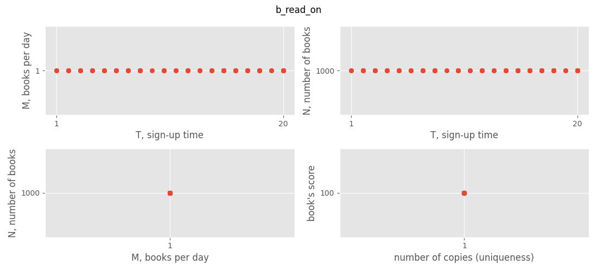
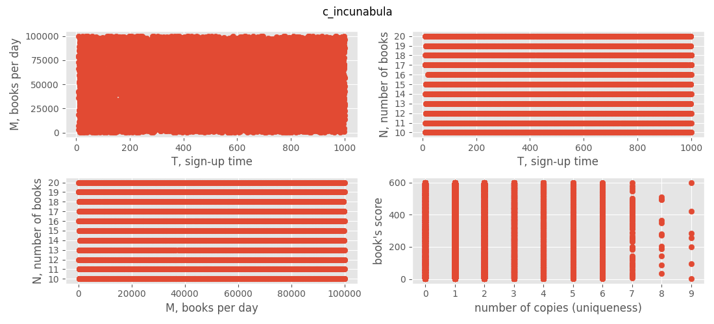
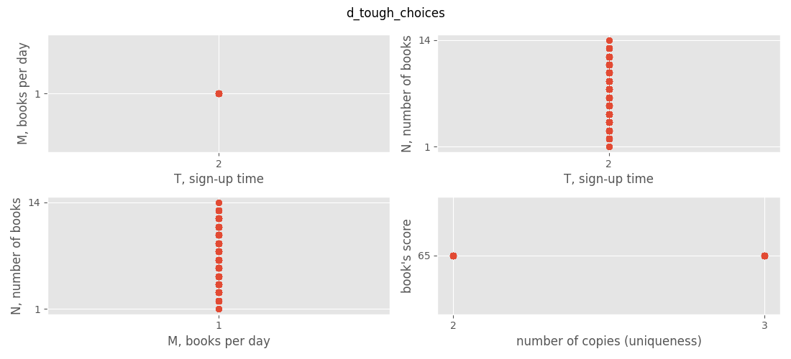
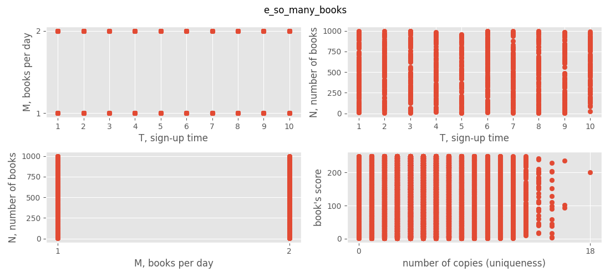
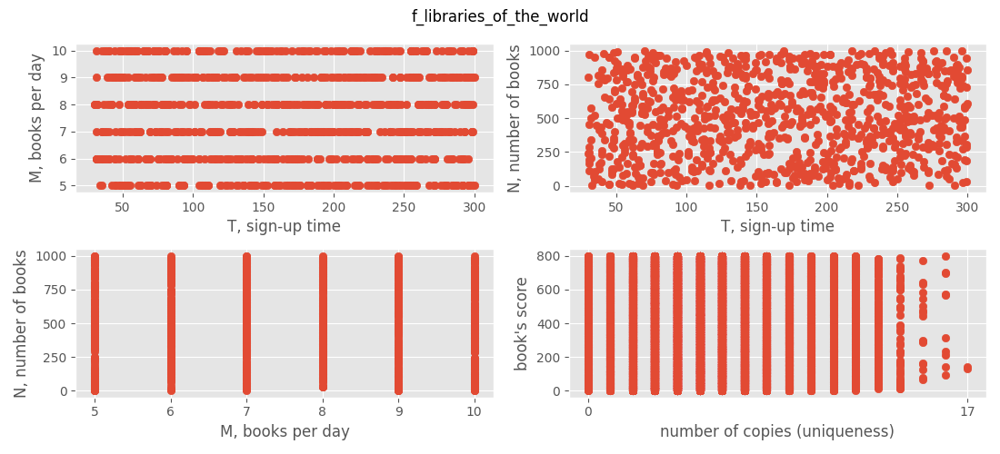

<!-- Github renders this as a table, why?
---
abstract: |
  The aim of this project was to find an algorithm that could solve an
  NP-hard problem. The selected problem was the book scanning problem
  proposed at Google Hashcode 2020 Qualifications Round. We decided to
  combine a greedy solver (good results to build on) with a genetic
  algorithm (able to explore more solutions). The results of our work
  are presented in this report.
author:
- Jędrzej Pacanowski
- Michał Wiliński
bibliography: bibliography.bib
date: Friday, 13th January, 2023
title: |
  Combinatorial Optimization Laboratories -- final project\
  Google Hashcode 2020 Solver\
---
-->

# final project report

authors: Michał Wiliński, Jędrzej Pacanowski

The aim of this project was to find an algorithm that could solve an
NP-hard problem. The selected problem was the book scanning problem
proposed at Google Hashcode 2020 Qualifications Round. We decided to
combine a greedy solver (good results to build on) with a genetic
algorithm (able to explore more solutions). The results of our work
are presented in this report.

 This work is licensed under a <a rel="license" href="http://creativecommons.org/licenses/by/4.0/">Creative Commons Attribution 4.0 International License</a>.

## Understanding the problem

Let us recall the conventions used in the task statement:

-   $B$ -- number of books, largest book ID minus one

-   $L$ -- total number of libraries

-   $D$ -- days for the scanning process (deadline)

-   $N_j$ -- number of books in the library $j$.

-   $T_j$ -- sign-up time of the library $j$

-   $M_j$ -- number of books that can be shipped from library $j$ each
    day (we call it "effectiveness")

After reading the problem statement and processing what is expected from
us we came to the following observations.

-   The order of library sign-ups is a permutation.

-   Each library has its own set of books. It can be represented as a
    list of book IDs.

-   In our program, we can consider solutions that propose scanning of
    books after the deadline $D$. It is a good assumption because in
    genetic algorithm terms, we can think about it as an inactive
    genome.

-   An exhaustive search would need $O(L! \cdot B!)$ steps to search for
    all possible solutions. This is not practical even for the small
    example input with small values of $B$ and $L$. Fortunately, it is
    possible to come up with polynomial-time algorithms which provide
    solutions with scores better than a random solution generator.

-   When given a specific permutation of libraries, we can always,
    optimally for this permutation, order books in each one of them.

-   This can be achieved by going through each library, in the same
    order as they will be scanned, sorting books according to score, and
    pushing the duplicates to the end of the books array or deleting
    them completely. The second part can be achieved by a simple linear
    pass through an array of books from each library.

-   Sorting books in each library has complexity of $O(N_j \log N_j$)
    where $L$ is the number of libraries and $N_j$ is the number of
    books in the jth library. In total $O(L\, B \log B$) because
    $N_j \leq B$.

There is a simple upper bound which is the sum of scores of all books.
$$\sum_{i} S_i$$

## About provided instances

#### a_example

There is nothing special about the example input. All of the books are
visible on the scatter plots. This instance is only a debug instance,
useful for testing parsers and debugging solvers.

#### b_read_on

For instance 'b', every book has the same score and only one copy. Each
library can send only one book per day. In this example, $N_j = D$, so
any library will have books to send. In this example, the optimal order
of libraries is achieved by sorting them on the remaining criterion --
registration time.

#### c_incunabula

Instance 'c' has no obvious patterns like the previous ones. We can just
say how many values a variable has.

Libraries have from 10 to 20 books, but they can take up to 1000 days to
register.

#### d_tough_choices

Instance "tough choices" is *a little more interesting*. What makes it
different is that number of books (in each library) is
$1 \leq N_j \leq 14$, which is much smaller than $D = 30 001$. Every
library has the same sign-up time and efficiency.

Every book has exactly one or two duplicates. Given that the number of
libraries is about half of $D$, possibly there is a large overlap
between the books.

During our testing, this instance took the longest time for our solver
to finish.

#### e_so_many_books

In instances "e" and "f" we have encountered an anomaly -- our program
shows that some books have 0 copies (similarly to "c"). It means that
some book IDs are unused. This may affect the upper bound.

Some variables have so small set of values that each possibility is
visible on the graphs.

#### f_libraries_of_the_world

Instance "f" does not show any clear pattern, either, apart from
possible values of parameters and books with 0 appearances in any
library.

## Ideas

Our inspiration was GRASP[@Feo1995GreedyRA] about which we had an
opportunity to learn at Professor Maciej Drozdowski's lectures on
Combinatorial Optimization. The combination of randomizing solutions
with some greedy base was a very compelling and interesting approach, so
we decided to combine the greedy algorithms with a somewhat random
biologically-inspired approach of the evolutionary algorithm.

## Greedy approaches

Notice that library registrations (sign-ups) can be ordered separately
from the books that belong to them.

### Taking duplicates into account

In order to solve the issue with books being scanned multiple times,
each solution in our solver is corrected.

The book improver iterates through each library from first registered to
last and sorts its books by the score in descending order. Books that
already have been seen in a given permutation of libraries have been
assigned a score of 0 in the sorting key, so the duplicates are always
scanned at the end.

The complexity of the improver is: $$O(L \cdot B \log B)$$

### Initial fast solver

The first algorithm that will output a solution is the fast solver. It
works as follows:

-   For each library calculates its score.

-   The score is computed by summing all books in the given library that
    can be scanned by this library

-   Then the score is divided by the signup time taken to a given power

-   The libraries are sorted by this score in descending order

-   Books are ordered using the book improver

The complexity of this first solution finding, excluding the book
improver is: $$O(B \cdot L \log L)$$

### Many combinations

We used multiple inheritance to our advantage -- combining different
heuristics that can sort the libraries with heuristics that can order
the books. This feature of Python language described by Guido van Rossum
[@van_rossum_2010] enabled us to do a modular design. When adding a new
heuristic a programmer needs to write a class and then append it to the
list of available sorters.

These greedy algorithms have the complexity of
$$O(L \log L + L\, B \log B)$$
It should be sufficient for the limits
described in the problem statement.

### Sorting libraries

Here are list of ideas which we used as a "sorting key function" for the
order of libraries:

-   $M_j$ -- library efficiency. For a single library, the more books it
    can send per day, the better. In the case of multiple libraries, it
    may be better to have fewer books per day but register more
    libraries.

-   $T_j$ -- library sign-up time. This is a simple way to assign as
    many libraries as possible in the shortest time period. For example,
    in input "b read on\" (which has $D=100$) - where every library has
    $M_j = 1$ - we can choose either 5 libraries with a registration
    time of 20 or 100 libraries with a registration time of 1.

-   $N_j$ -- number of books in the library.

-   ${M_j} / {T_j}$ -- combination of the previous two. It awards for
    the "efficiency" of a library and penalizes long registration time.

### Sorting books in each library

A set of books inside a library is turned into a sequence by sorting
them separately from each other. We implemented the following ideas:

-   The simplest approach is just to order books descending by their
    score -- $S_i$.

-   In this problem duplicate books are counted only once, therefore we
    want books that have fewer repetitions between libraries or even
    unique. Sort ascending by the number of copies (appears as
    "uniqueness" internally).

-   Simply combining the previous two approaches. For example, we can
    make a function $$f(d_i, S_i) = \max(11 - 1*d_i) * S_i$$ where $d_i$
    is the number of copies of book $i$ in the instance.

    A line function is not ideal here in the sense that the difference
    between 1 and 2 copies is the same as the difference between 9 and
    10 copies.

### Cartesian product -- combining both separate approaches

For each combination of heuristics listed above an auxiliary class is
created that inherits `key_libr` method from a library sorter and
`key_book` method from a book sorter. This way we get $5 \cdot 3 = 15$,
solution candidates.

### Complex greedy - dynamic re-scoring

The most time-consuming approach to our greedy ideas is dynamic
re-scoring. It works as follows:

-   Initialize an empty array of libraries.

-   Calculate the score for each library, the same way as in the
    **Initial fast solver**.

-   Add the library with the highest score to the permutation, add its
    books to the set of seen books, and subtract its signup time from
    the remaining time to allocate.

-   Re-score the libraries after each addition.

-   Continue adding the libraries until we have some that were not added
    or we run out of time.

-   Complete the permutation if needed with the set of unassigned
    libraries.

As the best library is selected at most $L$ times, the complexity of
this approach is: $$O(L^2 \cdot B \log B)$$

## Evolutionary approach

A genetic algorithm did not turn out to be much useful. Sometimes it is
for it to explore new solutions, but usually, it adds little value to
the solutions.

When preparing the report, we notices that we named our class in the
code wrongly. The name *genetic programming* refers to an algorithm that
uses binary vectors of fixed length. Our implementation uses the natural
representation of the problem as permutations, so we should have called
it an *evolutionary algorithm*. [@MK-ALIFEscript]

### Mutation

The mutation is applied only to the sequence of libraries. On
probability, $P_{mut}$ 10% of adjacent library pairs are swapped. We
decided to go with this implementation of mutation because it guarantees
us 2 things:

-   The swaps will not be changing the solution substantially, but only
    by a little, so the mutation will be only a slight change, as it
    should be in the evolutionary approach

-   By choosing the 10% of libraries to swap, if we decide to mutate the
    candidate we ensure that the mutation has enough power.

### Crossover

Crossover is happening only inside the libraries. We tested different
crossover approaches, focusing only on those that are suitable for
permutation problems. The best choice by intuition and by scores is the
**Alternating-postion crossover**[@article1]. Having 2 parents - one
with genotype `AAAA` and the other with genotype `BBBB`, this crossover
method will yield children - one `ABAB` and the other `BABA`. This
ensures that the crossover will keep the relative order of libraries
among the parents, while having the characteristics of the other parent.

### Selection strategies

We perform simple top-n-best solutions tournament selection for
crossover.

## Implementation details

We decided to implement this solution in Python. It made the
implementation of our ideas faster and there was no need to wait for a
compiler to finish.

The solver detects some basic facts about the problem instance. For
example, when every book has an equal score, the sorting of books is
turned off in order to save computation time.

The multiple inheritance[@z10.1145/236338.236343] helped us in creating
interesting combinations of different sorting heuristics that we
implemented.

The code is divided into the following files:

`main_solver.py` -- main entry point of the solver, which reads from the
standard input stream and prints the solution to the standard output
stream.

`loader.py` -- reading problem instances and fact checking.

`submission.py` -- printing the final solution and computing its score.

`strategies/` -- directory containing the implementations of various
algorithms, which we then combine in the main module.

`strategies.random` -- random solution generator; used as a baseline to
compare to other solvers

`strategies.genetic` -- evolutionary algorithm

`strategies.greedy` -- greedy algorithms using multiple inheritance,
dynamic scoring algorithm, and "fast scoring" algorithm

There are two similar algorithms that choose library one after another.
Both `GreedyDynamic` and `GreedyChooseLibrary` have the $L^2$ term in
their complexities, but their processing time is different. It may
happen due to Python interpreter internals, such as memory allocation or
garbage collection.

There is one small difference the `Submission` class numbers libraries
in the order of registrations, but the `Candidate` classes store the
libraries in the order of ID-s.

We also implemented our own **random instance generator**, where we
provide a simple config file (.toml format) and this generator outputs
us an instance of the library problem with given statistics.

We tested the program and it always finished in under 300 seconds. The
greedy heuristics with two separate sorting keys usually finish in under
a second.

## Conclusions and results

Baseline results prove that generating random solutions is not enough to
solve this problem.

| input file               | min. score | best score |
|:-------------------------|-----------:|-----------:|
| a_example                |         16 |         21 |
| b_read_on                |  3 794 000 |  4 655 300 |
| c_incunabula             |    792 168 |    973 115 |
| d_tough_choices          |  4 335 955 |  4 362 930 |
| e_so_many_books          |    386 907 |    813 848 |
| f_libraries_of_the_world |    115 797 |  1 625 402 |
| total                    |  9 424 843 | 12 430 616 |

Example results from random solutions generator

Next, we have implemented greedy algorithms with multiple inheritance.
This idea gave us the sum of scores 21 million.

| input file               |      score |     |
|:-------------------------|-----------:|----:|
| a_example                |         21 |     |
| b_read_on                |  5 822 900 |     |
| c_incunabula             |  5 467 966 |     |
| d_tough_choices          |  4 357 405 |     |
| e_so_many_books          |  3 646 017 |     |
| f_libraries_of_the_world |  2 420 875 |     |
| total                    | 21 715 964 |     |

Results from combinations of simple greedy algorithms

| input file               |      score |     |
|:-------------------------|-----------:|----:|
| a_example                |         21 |     |
| b_read_on                |  5 822 900 |     |
| c_incunabula             |  5 639 697 |     |
| d_tough_choices          |  4 815 395 |     |
| e_so_many_books          |  4 919 328 |     |
| f_libraries_of_the_world |  5 277 206 |     |
| total                    | 26 474 547 |     |

Results of fast greedy algorithm

## Final results

| input file               |      score |    upper bound |
|:-------------------------|-----------:|---------------:|
| a_example                |         21 |             21 |
| b_read_on                |  5 822 900 | 107 |
| b_read_on                |  5 822 900 | $10^7$ |
| c_incunabula             |  5 688 791 |     23 372 244 |
| d_tough_choices          |  5 028 530 |      5 109 000 |
| e_so_many_books          |  4 999 323 |     12 457 261 |
| f_libraries_of_the_world |  5 322 233 |     39 885 586 |
| total                    | 26 861 798 |                |

Final scores on the provided instances.

The upper bound is too weak to tell something more about the solutions'
quality, or even if they are close to the optimum. One exception is
input 'd' where our solution achieved 98% of the upper bound. Taking
into account that the highest score was 27 137 921 and taking into
account other scores form Poland, we were satisfied with our results.

